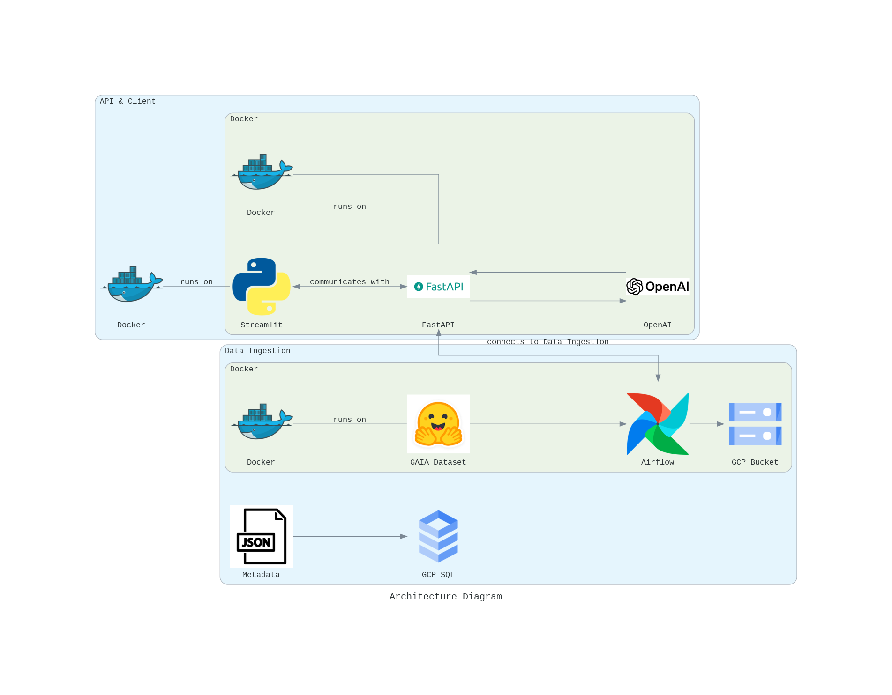

### Assignment2

The goal of this project is to automate the extraction of text from PDF files and provide a user-friendly interface for interacting with the extracted data. The project integrates automated data extraction using Airflow, PyPDF2, and Azure Document Intelligence, with a client-facing application built using Streamlit and FastAPI.

Key technologies involved include:
 **Streamlit**: Interactive UI framework for data exploration and user input.
- **FastAPI**: Backend framework for managing user authentication, API communication, and serving processed data.
- **PyPDF2**: An open-source library for extracting text from simple PDF files.
- **Azure Document Intelligence**: Used for advanced text extraction from complex PDFs containing tables and structured data.
- **Airflow**: Orchestrates the PDF processing pipelines, automating extraction and data uploads.
- **Google Cloud Platform (GCP)**:
  - **Google Cloud Storage (GCS)**: Stores extracted text and processed files.
  - **GCP SQL (MySQL Database)**: Stores metadata of processed PDFs and user credentials for authentication.

## Project Resources

Google collab notebook: https://colab.research.google.com/drive/1H78r4BZynBK4jxVNtZfMn8BgzBlUjeuh?usp=sharing

Google codelab: [https://codelabs-preview.appspot.com/?file_id=1r22xjHpWOK1GBYjrgJxDEu2EVpfbIeNmms62R1VADps#0]

Demo Video URL: https://drive.google.com/file/d/15uZEUIzM380tWLgTcy5BQN5SA_6WAFyi/view?usp=drive_link

### Tech Stack
Python | Streamlit | FastAPI | PyPDF2 | Azure Document Intelligence | Airflow | Docker | Google Cloud Platform (GCP) | GCP SQL | Google Cloud Storage (GCS) | OpenAI | MySQL

### Architecture diagram ###

### Project Flow

### Part 1: Automating Text Extraction and Database Population
1. **Airflow Pipelines**:
   - **clone_repo**: Clones the repository containing the GAIA dataset and processing scripts.
   - **filter_pdfs**: Filters relevant PDF files from the dataset for processing.
   - **process_pdfs**: Uses PyPDF2 and Azure Document Intelligence to extract text from the PDFs.
   - **upload_files**: Uploads the extracted text and results to Google Cloud Storage (GCS).

2. **Storage in GCP SQL**:
   - Extracted metadata is stored in a MySQL database hosted on GCP SQL, allowing efficient querying and data management.

### Part 2: Client-Facing Application using Streamlit and FastAPI
1. **FastAPI**:
   - Handles user registration and login using JWT authentication.
   - Serves as the backend for processing user queries and interacting with OpenAI.
   - Exposes API endpoints for managing PDF processing and fetching results.
   
2. **Streamlit Application**:
   - Provides a registration and login interface.
   - Allows users to select PDF files for analysis and view extracted content.
   - Facilitates comparison of OpenAI responses with the expected answers from the GAIA dataset.
   - Displays visualizations to assess the accuracy of model responses.

3. **Deployment**:
   - Both Streamlit and FastAPI are containerized using Docker for consistent deployment.
   - The applications are hosted on a public cloud, ensuring scalability and ease of access.

### Contributions

| Name                            | Percentage Contribution |
| ------------------------------- | ----------------------- |
| Sarthak Somvanshi               | 33% (User login, JWT, GCP Deployment, Swagger UI)                    |
| Yuga Kanse                      | 33% (OpenAI Integration, FastAPI Integration, Summary and Submit Page)                  |
| Tanvi Inchanalkar               | 33% (Pypdf and Azure AI Document Intelligence Airflow Pipelines, Documentation)                   |

### Additional Notes
WE ATTEST THAT WE HAVEN’T USED ANY OTHER STUDENTS’ WORK IN OUR ASSIGNMENT AND ABIDE BY THE POLICIES LISTED IN THE STUDENT HANDBOOK. 

